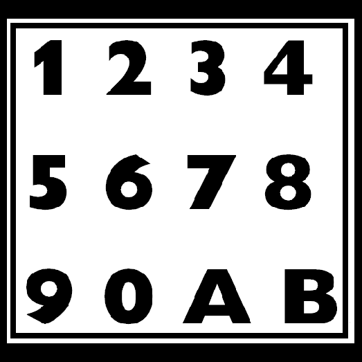
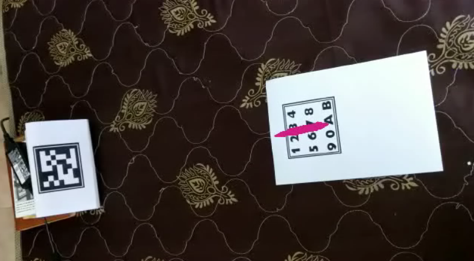

# Augmented-Reality-Application

Augmented reality has started becoming mainstream in a number of applications. In this assignment, you will build an augmented reality application with your own webcam.

1. Calculate the camera calibration matrix for your webcam using multiple views of a chessboard pattern. 
2. Create three visual markers which are easy to detect. Some examples are as follows:

3. For a single visual marker, take a video input from the webcam. Estimate and explicitly print out the pose of the camera (R,t) for every frame. Render a 3D model (.obj file) on top of the visual marker as if the model is lying vertically on the marker.

4. In this part, there are two visual markers. The first visual marker lies on a flat surface. The second marker is in a plane roughly perpendicular to the plane of the first marker. The augmented object starts moving from the first marker and stops when it hits the second marker. An illustration follows:

5. The cow in the video is jumping because the estimation is not very accurate. Use improvisations to make the object as stable as possible.

